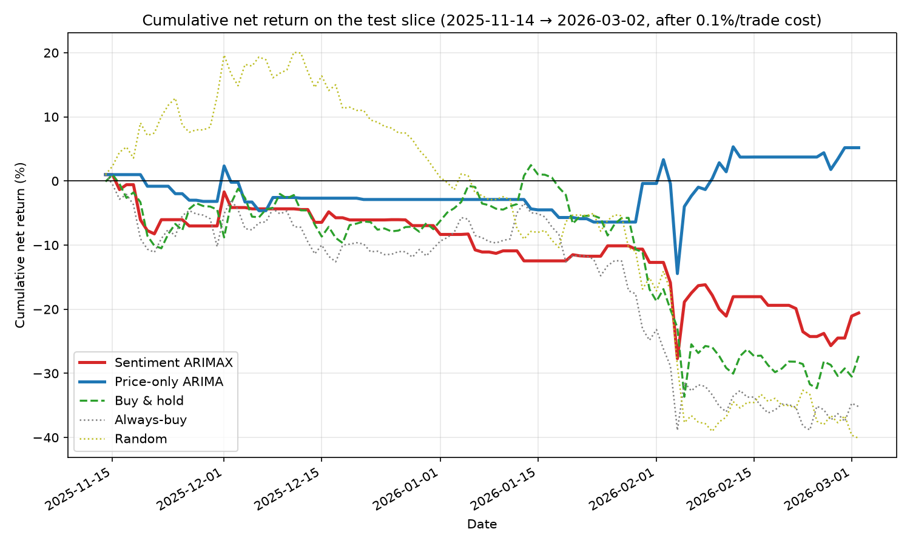

# Does Twitter sentiment improve short-horizon BTC return forecasting?

**Answer: No.** On a leak-free, out-of-sample, cost-aware backtest, adding aggregate
social-media sentiment to a price-only return forecaster **did not improve** next-day
Bitcoin trading decisions — it slightly degraded them. This is a clean, honest null,
and it agrees with a pre-build Granger-causality check that found no sentiment lead.

## What was built

An end-to-end pipeline: score tweets with VADER → aggregate to influence-weighted
daily sentiment → fuse with price features → forecast the **next-day return** with
ARIMAX → threshold into buy/sell/no-trade → evaluate with a fixed-holding-period
backtest against dumb baselines. The evaluation harness was built and **proven honest
against a random signal before any model existed**.

## Setup

| | |
|---|---|
| Asset / bar / horizon | BTC / daily / hold N=1 bar (forecast r₍t+1₎) |
| Window | 2025-11-14 … 2026-03-02 test; train ends 2025-11-14 (253 train / 109 test) |
| Transaction cost | 0.1% per trade |
| Sentiment | VADER compound, influence-weighted by log(1+followers); mean, post-volume, dispersion |
| Empty-bar policy | sentiment forward-filled across no-tweet days (~45% of bars) |
| Model | ARIMAX(2, 0, 2) on the return; sentiment enters as exogenous regressors |

## Methodology & honesty safeguards

- **Target is a return, never a price level** — predicting price at short horizons
  trivially "succeeds" by echoing the last price; forecasting r₍t+1₎ removes that.
- **Leak-free, out-of-sample** — chronological split (never shuffled), scaler fit on
  train only, every feature lagged so row t uses only information through the close
  of t, verified by an automated no-look-ahead check.
- **Honest harness** — a random buy/sell signal earns ≈ −cost per trade, a ~0.5 hit
  rate, and beats buy-and-hold only ~7% of the time. The backtest cannot be fooled.
- **Clean ablation** — the sentiment model is identical to the price-only control
  except for the sentiment regressors.

## Pre-build validation (Phase 3)

Both hard gates passed (target is a return; split is leak-free). All series are
stationary (ADF p < 0.001). Granger causality — does lagged sentiment predict the
return beyond the return's own past? — found **no significant lead**:

| sentiment feature | min p-value | best lag |
|---|---|---|
| sent_wmean | 0.558 | 2 |
| sent_postvol | 0.461 | 1 |
| sent_disp | 0.189 | 5 |

All p-values ≫ 0.05, so a tradeable sentiment edge was implausible going in. We ran
the full experiment anyway and reported it.

## Results

| strategy | trades | avg_net_return | hit_rate | cumulative_net_return |
|---|---|---|---|---|
| Sentiment ARIMAX | 51 | -0.00395 | 0.373 | -0.2059 |
| Price-only ARIMA | 35 | 0.00221 | 0.429 | 0.0519 |
| Buy & hold | 1 | -0.2728 | 0 | -0.2728 |
| Always-buy | 112 | -0.00351 | 0.402 | -0.3559 |
| Random | 112 | -0.00464 | 0.42 | -0.4335 |

Directional accuracy (sign of forecast vs realized return, traded bars):
price-only **0.429**, sentiment **0.412** — both **below 0.5**.

**Reading the numbers.** The test slice was a BTC **downtrend** (buy-and-hold
-27%), so every always-in-market baseline lost heavily.
The price-only model's small **positive** cumulative (+5.2%)
is **not evidence of skill**: its directional accuracy is below a coin flip, so the
result comes from a handful of large short trades landing in a falling market — a
small-sample artifact, not a predictive edge. Adding sentiment
(did NOT beat the control) pushed cumulative return to
-20.6%, lowered the hit rate, and moved directional
accuracy further below chance. **Sentiment added noise, not signal.**

## Limitations

- **Directional prediction is genuinely hard** — the literature and our Granger
  result both expect public sentiment to lag price or help only fleetingly. A null
  is the expected outcome, not a bug.
- **Bots & manipulation** — crypto social sentiment is adversarial (pump-and-dump
  shilling, bot swarms); raw aggregate sentiment can be dominated by coordinated
  activity. We did not detect or filter this.
- **Single asset, single window, one regime** — BTC only, ~1 year, and a
  downtrending test slice. Results may not generalize across assets or regimes.
- **No position sizing** — one fixed-size, fixed-exit trade at a time; no capital
  allocation, stop-losses, or risk control beyond the decision threshold.
- **Sentiment sparsity / staleness** — ~45% of days had no tweets and were
  forward-filled, and dense days were sampled to ≤3k tweets; both blunt the signal.
- **Small trade counts** — 35–51 trades make cumulative return noisy; treat single
  cumulative figures with caution.

## Conclusion

Built and evaluated honestly, **aggregate Twitter sentiment did not improve
short-horizon BTC return forecasting over price history alone**, and degraded it on
this test slice. The price-only control showed no genuine directional skill either.
The value of this project is the **correct, leak-free, baseline-anchored methodology**
and a clearly-reported null — exactly the defensible outcome the design anticipated.
